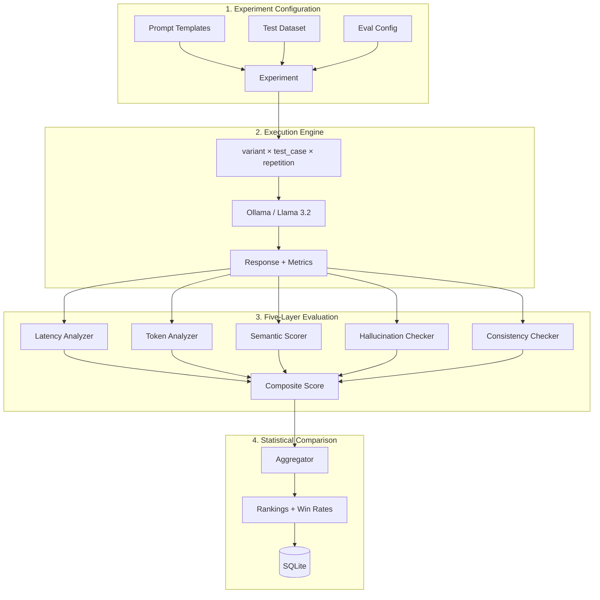

# LLM Evaluation & Prompt Testing Dashboard


## What This Project Does

**In one sentence:** You define prompt variants and test datasets, the system runs controlled experiments against Llama 3.2, measures everything (latency, tokens, hallucination rate, consistency), and produces statistical comparison reports to find the best prompt.

### The Full Picture

Say you have 3 prompt variants for a Q&A task and 15 test questions with known ground-truth answers:

```
┌─────────────────────────────────────────────────────────────────┐
│  1. EXPERIMENT SETUP                                            │
│                                                                 │
│  Create an experiment with:                                     │
│    • Multiple prompt templates (variants to A/B test)           │
│    • A test dataset (questions + expected answers)              │
│    • Evaluation config (which metrics, how many runs per combo) │
└─────────────────────────────────────────────────────────────────┘
                            ↓
┌─────────────────────────────────────────────────────────────────┐
│  2. EXECUTION ENGINE                                            │
│                                                                 │
│  For each (prompt_variant × test_case × repetition):            │
│    • Format the prompt with the test input                      │
│    • Send to Llama 3.2 via Ollama                               │
│    • Capture: raw response, latency, token counts               │
│    • Run N repetitions for statistical significance             │
│    • Handle timeouts, retries, rate limiting                    │
└─────────────────────────────────────────────────────────────────┘
                            ↓
┌─────────────────────────────────────────────────────────────────┐
│  3. FIVE-LAYER EVALUATION PIPELINE (per response)               │
│                                                                 │
│  Layer 1: Latency — total_ms, tokens/sec                        │
│  Layer 2: Token Efficiency — prompt/completion ratio, verbosity │
│  Layer 3: Semantic Quality — embedding similarity + LLM Judge   │
│  Layer 4: Hallucination Detection — claim extraction + verify   │
│  Layer 5: Consistency — cross-run variance, semantic drift      │
└─────────────────────────────────────────────────────────────────┘
                            ↓
┌─────────────────────────────────────────────────────────────────┐
│  4. STATISTICAL COMPARISON                                      │
│                                                                 │
│  Aggregate per prompt variant:                                  │
│    • Mean, median, p95, stddev for every metric                 │
│    • Win-rate matrix (variant A vs B vs C head-to-head)         │
│    • Rank prompts by composite score                            │
│    • Export JSON reports via REST API                            │
└─────────────────────────────────────────────────────────────────┘
```

### Why This Matters (vs manual prompt testing)

| Manual Testing | This System |
|:---|:---|
| Copy-paste prompts into a chat, eyeball the result | Automated execution with statistical repetition |
| No idea if latency changed between prompt versions | Per-token latency profiling across variants |
| "This prompt seems better" (gut feeling) | Embedding similarity + LLM-Judge + hallucination rate |
| No reproducibility | Controlled experiments with seeded datasets |
| Can't compare 5 prompts across 50 test cases | Full execution matrix with batch processing |

Everything runs locally on **Llama 3.2 via Ollama** — no API keys, no cloud costs.

---

## Architecture

For the detailed version, see [docs/architecture.md](docs/architecture.md).



---

## Tech Stack

| Component | What | Why |
|:---|:---|:---|
| Python 3.11+ | Language | Async support, type hints |
| Llama 3.2 (3B) | Text generation, LLM-as-Judge | Runs locally via Ollama, no API keys |
| nomic-embed-text | 768-dim embeddings | Semantic similarity scoring |
| FastAPI | REST API | Async, auto-generated Swagger docs |
| SQLite + FTS5 | Storage | Experiments, results, full-text search |
| Pydantic v2 | Data models | 25+ schemas with validation |
| structlog | Logging | Structured, machine-parseable logs |
| Click + Rich | CLI | Beautiful terminal interface |
| Docker Compose | Deployment | One command to start everything |
| GitHub Actions | CI | Lint + 31 tests on every push |

---

## How To Run It

### Option A: Docker (easiest)

```bash
# Start everything
docker-compose up -d --build

# Pull the LLM models (first time only)
docker exec -it ollama_eval ollama pull llama3.2
docker exec -it ollama_eval ollama pull nomic-embed-text

# API is now at http://localhost:8000
# Swagger docs at http://localhost:8000/docs
```

### Option B: Local development

**1. Install Ollama and pull models**
```bash
# Download from https://ollama.com, then:
ollama pull llama3.2
ollama pull nomic-embed-text
```

**2. Set up Python**
```bash
python -m venv venv
venv\Scripts\activate          # Windows
source venv/bin/activate       # macOS/Linux
pip install -r requirements.txt
```

**3. Configure**
```bash
copy .env.example .env
# Defaults work out of the box for local development
```

**4. Run the API**
```bash
uvicorn src.api.main:app --host 0.0.0.0 --port 8000
# API at http://localhost:8000
# Swagger at http://localhost:8000/docs
```

**5. Or use the CLI**
```bash
set PYTHONPATH=.               # Windows
export PYTHONPATH=.            # macOS/Linux

# Seed demo data
python -m scripts.seed_sample_experiment

# Run the experiment
python -m src.cli list-experiments
python -m src.cli run-experiment <experiment_id>
python -m src.cli show-results <experiment_id>
```

---

## Using the API

**Create a test dataset:**
```bash
curl -X POST http://localhost:8000/api/v1/datasets \
  -H "Content-Type: application/json" \
  -d '{
    "name": "My QA Dataset",
    "test_cases": [
      {
        "input_variables": {"question": "What is RAG?"},
        "reference_answer": "RAG combines retrieval with generation.",
        "reference_context": "Retrieval-augmented generation enhances LLM outputs..."
      }
    ]
  }'
```

**Create an experiment:**
```bash
curl -X POST http://localhost:8000/api/v1/experiments \
  -H "Content-Type: application/json" \
  -d '{
    "name": "Prompt Comparison",
    "prompt_templates": [
      {"name": "concise", "template": "Answer briefly: {question}"},
      {"name": "detailed", "template": "Explain thoroughly: {question}"}
    ],
    "dataset_id": "<dataset_id>",
    "eval_config": {"repetitions": 3, "enable_llm_judge": true}
  }'
```

**Run the experiment:**
```bash
curl -X POST http://localhost:8000/api/v1/experiments/<id>/run
```

**Get results:**
```bash
curl http://localhost:8000/api/v1/experiments/<id>/results
curl http://localhost:8000/api/v1/experiments/<id>/compare
```

### All Endpoints

| Method | Endpoint | What it does |
|:---|:---|:---|
| `GET` | `/api/v1/health/live` | Liveness check |
| `GET` | `/api/v1/health/ready` | Checks DB + Ollama connection |
| `POST` | `/api/v1/datasets` | Create test dataset |
| `GET` | `/api/v1/datasets` | List all datasets |
| `GET` | `/api/v1/datasets/{id}` | Get dataset with test cases |
| `DELETE` | `/api/v1/datasets/{id}` | Delete dataset |
| `POST` | `/api/v1/experiments` | Create experiment |
| `GET` | `/api/v1/experiments` | List all experiments |
| `GET` | `/api/v1/experiments/{id}` | Get experiment details |
| `DELETE` | `/api/v1/experiments/{id}` | Delete experiment + all data |
| `POST` | `/api/v1/experiments/{id}/run` | Execute experiment (background) |
| `GET` | `/api/v1/experiments/{id}/results` | Full comparison report |
| `GET` | `/api/v1/experiments/{id}/compare` | Simplified variant comparison |
| `GET` | `/api/v1/results/experiment/{id}` | All individual run results |
| `GET` | `/api/v1/results/experiment/{id}/variant/{vid}` | Per-variant results |
| `GET` | `/api/v1/results/experiment/{id}/stats` | Quick run statistics |

---

## Configuration

All config lives in `.env` (or environment variables). Copy `.env.example` to get started.

| Variable | Default | What it controls |
|:---|:---|:---|
| `OLLAMA_BASE_URL` | `http://localhost:11434` | Where Ollama is running |
| `TEXT_MODEL` | `llama3.2` | LLM for generation and judging |
| `EMBED_MODEL` | `nomic-embed-text` | Embedding model for similarity |
| `WEIGHT_SEMANTIC_QUALITY` | `0.35` | Composite weight for semantic scores |
| `WEIGHT_HALLUCINATION` | `0.25` | Composite weight for hallucination |
| `WEIGHT_LATENCY` | `0.15` | Composite weight for latency |
| `WEIGHT_CONSISTENCY` | `0.15` | Composite weight for consistency |
| `DEFAULT_REPETITIONS` | `3` | Default runs per (prompt × test_case) |
| `SQLITE_PATH` | `./data/eval_db.sqlite` | Database location |

Full list in [.env.example](.env.example).

---

## Evaluation Methodology

### Composite Score Formula

Each response is evaluated across 5 dimensions, normalized to [0, 1], and combined:

```
composite = 0.15 × latency + 0.10 × token_efficiency + 0.35 × semantic
          + 0.25 × (1 - hallucination_rate) + 0.15 × consistency
```

### What Each Layer Measures

| Layer | Metric | How |
|:---|:---|:---|
| Latency | `total_ms`, `tokens/sec` | Ollama response timing metadata |
| Token Efficiency | `verbosity_score` | Output word count / reference word count |
| Semantic Quality | `embedding_similarity`, `judge_average` | Cosine similarity + LLM-as-Judge (1-5 scale) |
| Hallucination | `hallucination_rate` | Claim extraction → embedding + keyword verification |
| Consistency | `agreement_rate` | Pairwise embedding similarity across repeated runs |

---

## Testing

```bash
set PYTHONPATH=.              # Windows
export PYTHONPATH=.           # macOS/Linux

python -m tests.test_schemas       # 19 Pydantic model tests
python -m tests.test_evaluation    # 8 evaluation module tests
python -m tests.test_storage       # 5 SQLite CRUD + cascade tests
python -m tests.test_execution     # 5 aggregation + ranking tests
python -m tests.test_hallucination # 10 NLI entailment + 3-layer logic tests
python -m tests.test_significance  # 10 Welch's t-test + Cohen's d tests
python -m tests.test_concurrency   # 2 async Semaphore concurrency tests
```

---

## Known Limitations & Optimization Roadmap

| # | Known Limitation | Planned Optimization |
| :--- | :--- | :--- |
| 1 | **Single-model only** (Llama 3.2 via Ollama) | ✅ **FIXED**: Added `LLMProvider` abstraction supporting OpenAI, Groq, Together, and Ollama. |
| 2 | **Sequential execution** | ✅ **FIXED**: Implemented `asyncio.Semaphore` based concurrent execution. |
| 3 | **Embedding-only hallucination detection** | ✅ **FIXED**: Added 3-Layer logic with NLI entailment and smart gating. |
| 4 | **No statistical significance tests** | ✅ **FIXED**: Built Welch's t-test and Cohen's d effect size natively. |
| 5 | **SQLite storage** | Migration path to PostgreSQL with SQLAlchemy async |
| 6 | **No streaming metrics** | Add SSE/WebSocket endpoint for live progress |
| 7 | **LLM-as-Judge uses same model** | Support separate judge model config |
| 8 | **No cost tracking** | Add token-to-cost mapping per provider |

---

## Project Structure

```
src/
├── config.py                    # Centralized Pydantic Settings
├── cli.py                       # Click + Rich CLI interface
├── models/
│   ├── schemas.py               # 30+ Pydantic data models
│   └── providers/               # LLM Provider abstraction (Ollama, OpenAI-compat)
├── evaluation/
│   ├── latency_analyzer.py      # Timing metrics extraction
│   ├── token_analyzer.py        # Token usage and efficiency
│   ├── semantic_scorer.py       # Embedding similarity + LLM-as-Judge
│   ├── hallucination_checker.py # 3-Layer NLI Claim Verification
│   ├── consistency_checker.py   # Cross-run stability analysis
│   ├── significance.py          # Welch's t-test and Cohen's d
│   └── composite_scorer.py      # Weighted composite scoring
├── execution/
│   ├── runner.py                # Experiment execution engine
│   └── result_aggregator.py     # Statistical aggregation + rankings
├── storage/
│   └── database.py              # SQLite with FTS5
└── api/
    ├── main.py                  # FastAPI app factory
    ├── dependencies.py          # Dependency injection
    └── routes/                  # Health, datasets, experiments, results
tests/                           # 31 tests: schemas, evaluation, storage, execution
scripts/                         # Demo data seeder
docs/                            # Architecture documentation
```
