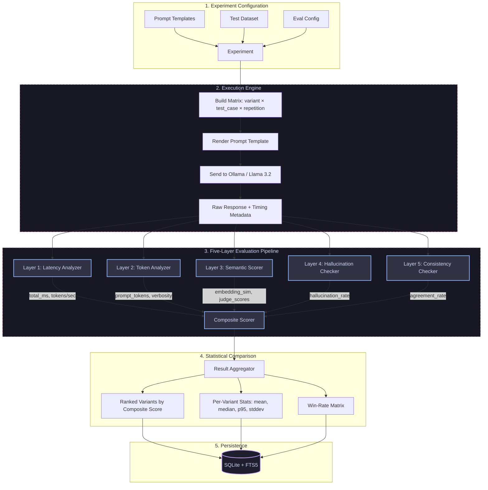

# System Architecture — LLM Evaluation & Prompt Testing Dashboard

This document details the design and data flow of the **LLM Evaluation & Prompt Testing Dashboard**. The system benchmarks LLM responses across latency, token efficiency, semantic quality, hallucination detection, and cross-run consistency using controlled experiments.

---

## 1. High-Level Flow Diagram



---

## 2. Evaluation Pipeline (Five Layers)

Each generated response passes through five independent evaluation modules:

### Layer 1: Latency Analyzer
- Extracts `total_ms` and `tokens_per_second` from Ollama response metadata
- No additional LLM calls required (pure metric extraction)

### Layer 2: Token Analyzer
- Counts `prompt_tokens` and `completion_tokens` from Ollama metadata
- Computes `output_input_ratio` (completion / prompt)
- Computes `verbosity_score` (response word count / reference word count)

### Layer 3: Semantic Scorer (Two Sub-Layers)
- **Embedding Similarity**: Cosine similarity between response and reference embeddings via `nomic-embed-text`
- **LLM-as-Judge**: Sends (question, response, reference) to Llama 3.2 with a structured rubric → returns `{relevance, correctness, coherence}` scores on a 1-5 scale

### Layer 4: Hallucination Checker
- Extracts atomic factual claims from the response via LLM
- Verifies each claim against reference context using:
  - Embedding similarity (cosine between claim and reference)
  - Keyword/entity overlap (proper nouns and numbers)
- Reports per-claim verification and overall `hallucination_rate`

### Layer 5: Consistency Checker
- Given N repeated runs of the same (prompt, input), embeds all responses
- Computes pairwise cosine similarity across all response pairs
- Measures `semantic_drift` (max deviation from centroid embedding)
- Reports `agreement_rate` (fraction of pairs above similarity threshold)

---

## 3. Composite Scoring Formula

All five dimensions are normalized to [0, 1] and combined with configurable weights:

```
composite = w_latency × latency_norm
          + w_token   × token_norm
          + w_semantic × semantic_norm
          + w_halluc   × hallucination_norm
          + w_consist  × consistency_norm
```

| Dimension | Default Weight | Normalization |
|:---|:---:|:---|
| Latency | 0.15 | `1.0 - (total_ms / 30000)` (lower is better) |
| Token Efficiency | 0.10 | `1.0 - abs(1.0 - verbosity)` (closer to 1.0 is better) |
| Semantic Quality | 0.35 | `judge_average / 5.0` or `embedding_similarity` as fallback |
| Hallucination | 0.25 | `1.0 - hallucination_rate` (lower rate is better) |
| Consistency | 0.15 | `agreement_rate` (higher is better) |

---

## 4. Statistical Aggregation

For each prompt variant across all test cases:
- **Per-metric stats**: mean, median, stddev, min, max, p95
- **Win-rate matrix**: For each pair of variants, which won more test cases (by embedding similarity)
- **Rankings**: Variants sorted by average composite score (descending)

---

## 5. Directory Mapping

* **Config & Schemas**:
  * [src/config.py](../src/config.py) — Central application configuration
  * [src/models/schemas.py](../src/models/schemas.py) — 25+ Pydantic data models
  * [src/models/llm_client.py](../src/models/llm_client.py) — Ollama client with latency instrumentation
* **Evaluation Layer**:
  * [src/evaluation/latency_analyzer.py](../src/evaluation/latency_analyzer.py) — Timing metrics
  * [src/evaluation/token_analyzer.py](../src/evaluation/token_analyzer.py) — Token efficiency
  * [src/evaluation/semantic_scorer.py](../src/evaluation/semantic_scorer.py) — Embedding + LLM-Judge
  * [src/evaluation/hallucination_checker.py](../src/evaluation/hallucination_checker.py) — Claim verification
  * [src/evaluation/consistency_checker.py](../src/evaluation/consistency_checker.py) — Cross-run stability
  * [src/evaluation/composite_scorer.py](../src/evaluation/composite_scorer.py) — Weighted composite
* **Execution Engine**:
  * [src/execution/runner.py](../src/execution/runner.py) — Experiment orchestration
  * [src/execution/result_aggregator.py](../src/execution/result_aggregator.py) — Statistical aggregation
* **Storage**:
  * [src/storage/database.py](../src/storage/database.py) — SQLite with FTS5
* **API**:
  * [src/api/main.py](../src/api/main.py) — FastAPI app factory
  * [src/api/dependencies.py](../src/api/dependencies.py) — Dependency injection
  * [src/api/routes/](../src/api/routes/) — Health, datasets, experiments, results routes
